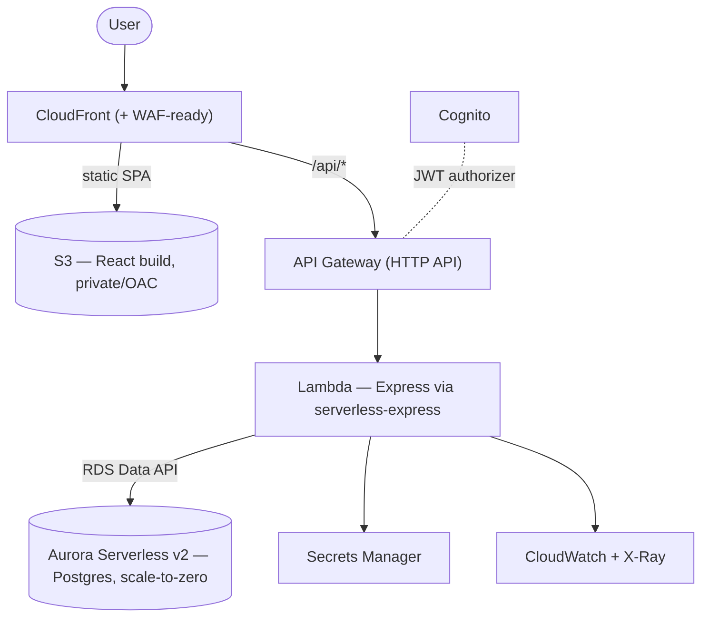

# Workout Tracker

A full-stack workout tracker, and an **on-prem → AWS cloud migration** exercise.
Built locally on a conventional stack, then re-architected and deployed to AWS as a
serverless application defined entirely in Infrastructure-as-Code.

> **Live demo:** https://dns1sty0z0vpl.cloudfront.net  ·  _demo credentials available on request_

## What it does

Log workouts on a calendar, track sets with weight / reps / **RPE**, record any daily metric
(bodyweight, sleep, steps…), and watch progress trend over time. Multi-user, with each user's
data isolated by their identity.

## Architecture (AWS, serverless)



| Layer | Service |
|---|---|
| Frontend | React + Vite SPA on **S3 + CloudFront** (Origin Access Control) |
| Auth | **Amazon Cognito** (JWT validated by the API Gateway authorizer) |
| API | **API Gateway (HTTP API)** → **Lambda** running the Express app |
| Data | **Aurora Serverless v2 (PostgreSQL)** via the **RDS Data API** (no VPC/NAT) |
| Secrets / encryption | **Secrets Manager**, **KMS** (at rest), TLS (in transit) |
| Observability | **CloudWatch Logs + X-Ray** |
| Infrastructure | **AWS CDK (TypeScript)** — tested (Jest) and security-linted (**cdk-nag**) |

**Why serverless:** the workload is low and spiky, so it's optimized for near-zero idle cost
— Lambda and Aurora both scale to zero. Full rationale, the 6 R's analysis, trade-off matrix,
and costs are in [`docs/ARCHITECTURE.md`](./docs/ARCHITECTURE.md) and the
[ADR](./docs/adr/0001-target-architecture-serverless-vs-containers.md).

## Tech stack

- **Frontend:** React, Vite, React Router, Tailwind CSS, Recharts, react-calendar
- **API:** Node.js, Express (locally over SQLite; on AWS over Postgres via the Data API)
- **Auth:** Amazon Cognito (replaced a local hand-rolled JWT implementation)
- **Infra:** AWS CDK (TypeScript), CloudFormation, cdk-nag, GitHub Actions CI

## Repository layout

```
client/   React SPA (Vite)
src/      Local Express API + SQLite (the "on-prem before")
infra/    AWS CDK app (the deployed serverless stack) + Lambda API + scripts
docs/     Architecture, ADR, migration runbook, deploy runbook, ops runbook
```

## Run it locally

```bash
# API
npm install && node src/index.js          # http://localhost:3000

# Frontend (separate terminal)
cd client && npm install && npm run dev    # http://localhost:5173
```

## Deploy to AWS

See [`infra/README.md`](./infra/README.md) for the full deploy/seed/destroy flow and a cost
note. In short: `cdk bootstrap` → `cdk deploy` → seed the database → build the SPA with the
Cognito outputs → `cdk deploy` again. Tear down anytime with `cdk destroy`.

## Documentation

Design and operations docs live in [`docs/`](./docs/) — architecture, the decision record,
the migration runbook, a deploy runbook, and an operations runbook for running it
day-to-day.
