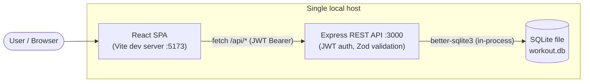
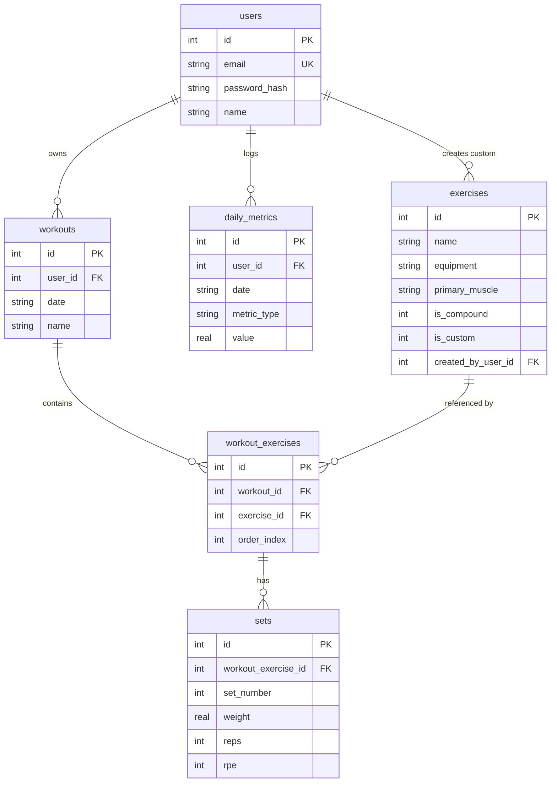
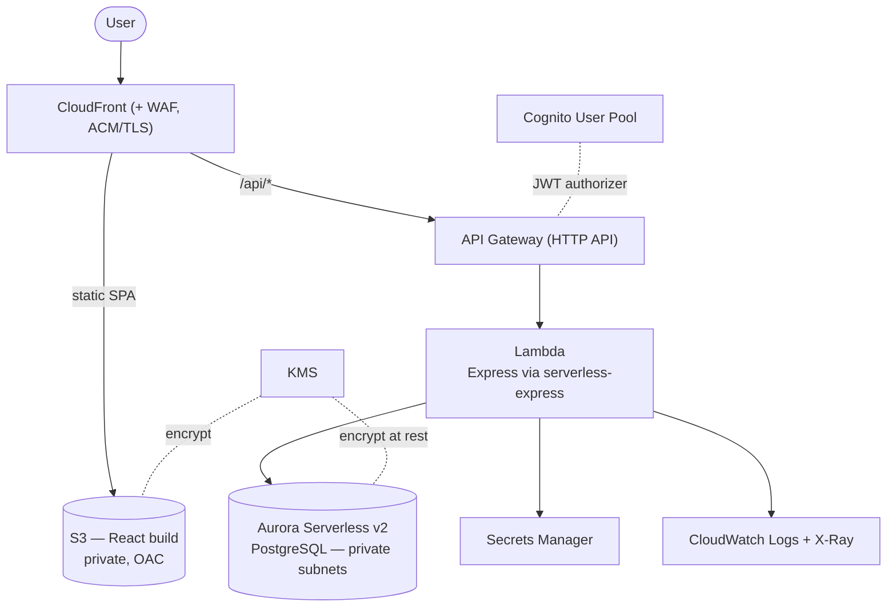
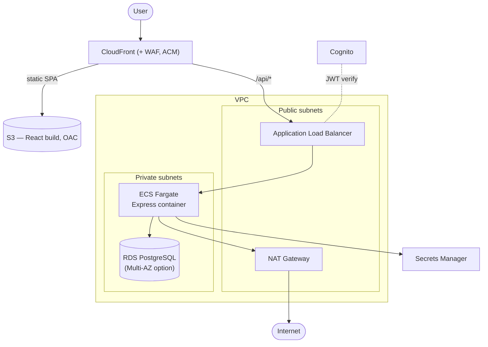

# Workout Tracker — Architecture & Migration Strategy

> **Document purpose.** This is the design artifact for migrating the Workout Tracker
> from a single local host ("on-prem before") to AWS. It covers the current-state
> assessment (Step 1) and the migration strategy with two candidate target
> architectures and an explicit trade-off analysis (Step 2). The chosen target is
> recorded in [ADR-0001](./adr/0001-target-architecture-serverless-vs-containers.md);
> migration mechanics, CDK implementation, and public-sector hardening follow in separate
> documents once this design is approved.

> **Accuracy notes (current build, not a template):**
> - The API is **Node.js / Express**, so the serverless target wraps the existing app
>   with **`@codegenie/serverless-express`** (a Lambda adapter). Mangum is the
>   Python/ASGI equivalent and is *not* used here.
> - The local database is **SQLite** (`better-sqlite3`), an embedded single-file DB —
>   not a networked Postgres server. This is material to the data-migration approach.
> - There are **no binary/file assets** today (exercises have no images), so DataSync
>   is not applicable yet. Noted where it *would* apply.
> - Auth today is **hand-rolled JWT** (`jsonwebtoken` + `bcrypt`). Both targets replace
>   this with **Amazon Cognito** — a deliberate security upgrade, accounted for as
>   refactor effort.

---

## 1. Current-State Assessment ("on-prem before")

### 1.1 Stack

| Layer | Technology | Notes |
|---|---|---|
| Frontend | React 19 + Vite SPA, React Router, Tailwind v4, Recharts, react-calendar | Built to static assets via `vite build`; runs on Vite dev server locally |
| API | Node.js + Express (ESM) | REST, JSON, stateless request handling; Zod request validation |
| AuthN/Z | `jsonwebtoken` (HS256) + `bcrypt` | Custom register/login, JWT in `Authorization: Bearer`, per-row ownership checks |
| Data | SQLite via `better-sqlite3`, WAL mode, FK enforcement | Single file `workout.db` on local disk |
| Hosting | One local host (developer machine / WSL) | Two processes: API `:3000`, Vite `:5173` with a dev proxy for `/api` |

### 1.2 Current architecture

**Key point for migration:** the API process and the database are co-located and the DB
is *embedded in-process*. There is no network boundary, no managed backups, no
horizontal scalability, and a single point of failure. The app is otherwise a textbook
**stateless API + relational store + static SPA** — which maps cleanly to managed AWS
services.

### 1.3 Data model

Relational, normalized, FK-linked. This is the single most important fact for service
selection: **the workload is relational and benefits from joins and ad-hoc aggregation**
(progress charts, "last time" lookups, cross-metric analysis). That argues for keeping
**PostgreSQL**, not remodeling onto a key-value store.

### 1.4 Migration-relevant characteristics

| Characteristic | Observation | Implication |
|---|---|---|
| Traffic profile | Low and spiky (personal scale; possibly a few users later) | Favors pay-per-use / scale-to-zero; idle cost is the dominant cost concern |
| State | Stateful, relational, FK-rich | Keep a managed **PostgreSQL** engine; avoid NoSQL remodeling |
| Data volume | Tiny (KB–MB) | One-shot migration; no need for heavy replication tooling |
| Binary assets | None today | No S3 object pipeline / DataSync needed yet |
| Auth | Custom JWT + bcrypt | Replace with Cognito (managed, MFA-capable) — counts as refactor effort |
| Availability need | Personal project; not yet mission-critical | Single-AZ acceptable for now; document the Multi-AZ upgrade path |
| Compliance | None for the personal app | But a public-sector deployment requires a documented hardening path (see hardening note) |
| Build artifacts | SPA compiles to static files | Natural fit for S3 + CloudFront (no server needed for frontend) |

---

## 2. Migration Strategy — the 6 R's

### 2.1 Which R applies

| R | Verdict | Reasoning |
|---|---|---|
| **Retire** | ✗ | The app is actively used and is the thing we're migrating — nothing to decommission. |
| **Retain** | ✗ | No reason to leave any component on-prem; there is no on-prem dependency to keep. |
| **Repurchase** | ✗ | We're not replacing the app with a SaaS product; the custom app *is* the deliverable. |
| **Rehost** ("lift & shift") | △ Considered | Could run the Express process + Postgres on a single EC2 instance. Fastest, but inherits the single-host weaknesses (patching, no autoscaling, idle cost ~24/7) and demonstrates the least cloud-native value. Rejected as the *target*, but it's the honest baseline to compare against. |
| **Replatform** ("lift, tinker & optimize") | ✓ Candidate | Containerize the Express API onto **ECS Fargate** + managed **RDS PostgreSQL** behind an **ALB**. Minimal code change, gains managed data + autoscaling. → **Target B.** |
| **Refactor / Re-architect** | ✓ Candidate | Re-architect to managed/serverless: **S3+CloudFront**, **Cognito**, **API Gateway → Lambda** (Express via serverless-express), **Aurora Serverless v2**. Most cloud-native, lowest idle cost, most managed. → **Target A.** |

**Bottom line:** Rehost is the baseline; the real decision is **Replatform
vs Refactor**, and the right answer is workload-driven, not fashion-driven.

### 2.2 Target A — Serverless (Refactor)

- **Frontend:** `vite build` → S3 (private bucket), served via CloudFront with Origin
  Access Control; ACM cert for TLS; WAF in front.
- **Auth:** Cognito User Pool issues JWTs; API Gateway HTTP API uses a **JWT authorizer**
  (no custom auth code to maintain).
- **Compute:** Existing Express app wrapped with `@codegenie/serverless-express`, run on
  Lambda. Near-zero idle cost; scales per request.
- **Data:** Aurora Serverless v2 (PostgreSQL) — keeps the relational schema verbatim.
  **DynamoDB alternative:** would force denormalization around fixed access patterns and
  break ad-hoc joins/aggregations the progress features rely on → high remodeling cost,
  rejected for this data model.
- **Observability/Secrets:** CloudWatch + X-Ray; DB credentials in Secrets Manager.

### 2.3 Target B — Containers (Replatform)

- Containerize Express (Dockerfile), push to ECR, run on **ECS Fargate** in private
  subnets behind an **ALB**. **RDS PostgreSQL** for data. **VPC** with public/private
  subnets, **NAT** for egress, security groups. Same S3+CloudFront frontend and Cognito.
- Closest to the current runtime (least code change), steady warm latency, but pays for
  always-on ALB + NAT + at least one task + RDS instance **24/7**.

### 2.4 Trade-off matrix

| Dimension | Target A — Serverless | Target B — Containers |
|---|---|---|
| **Idle / low-traffic cost** | ⭐ Excellent — ~$2–6/mo with Aurora Sv2 scaled to zero; compute bills per request | Poor — ~$45–110/mo; ALB + NAT + task + RDS bill 24/7 |
| **Cost at scale** | Good; per-request pricing can exceed containers only at sustained high RPS | ⭐ Better unit economics under steady, high, predictable load |
| **Ops burden** | ⭐ Lowest — no servers, OS, or container images to patch | Higher — images, task defs, VPC, scaling policies, base-image CVEs |
| **Migration effort & risk** | Higher — Lambda adapter + Cognito + API GW wiring | ⭐ Lower — lift the container; runtime nearly identical to today |
| **Latency / cold starts** | Lambda cold start ~0.1–0.8s; Aurora resume ~5–15s from zero | ⭐ Steady warm latency, no cold start (paid for 24/7) |
| **Data-model fit** | ⭐ Postgres keeps schema intact | ⭐ Postgres keeps schema intact (tie) |
| **Security posture** | ⭐ No public compute; managed auth; smaller attack surface | Strong, but more to secure (SGs, NAT, container supply chain) |
| **Time-to-deliver** | Fast once adapter + authorizer wired | Moderate (Dockerfile + VPC + ECS plumbing) |
| **Cloud-native fit** | ⭐ Highest — most idiomatic serverless architecture | Solid, more "traditional" |

### 2.5 Rough monthly cost (us-east-1, personal scale)

> Order-of-magnitude, to reason about **cost drivers** — not a billing quote.

**Target A (idle / demo):**

| Service | Idle cost | Driver / note |
|---|---|---|
| S3 + CloudFront | ~$0.50 | Tiny storage; CloudFront has no fixed idle fee; pay per request/GB |
| Cognito | $0 | Free up to 50k MAU |
| API Gateway (HTTP API) | ~$0 | $1.00 / million requests |
| Lambda | ~$0 | Generous free tier; pay per ms |
| **Aurora Serverless v2** | **$0–~$43** | **Primary driver.** Min 0 ACU (scale-to-zero) ≈ $0 idle + ~$0.10/GB storage. Min 0.5 ACU always-on ≈ ~$43/mo |
| Secrets Manager | ~$0.80 | $0.40 / secret / mo |
| KMS | $0–$1 | $1/mo per customer-managed key; AWS-managed keys are free |
| CloudWatch / X-Ray | ~$1–3 | Low at this volume |
| **Idle total** | **~$2–6 (scale-to-zero)** | vs ~$48 if Aurora min capacity left provisioned |

**Target B (idle / demo):**

| Service | Idle cost | Driver / note |
|---|---|---|
| **NAT Gateway** | **~$32 each** | **Primary driver.** ~$0.045/hr + data. Mitigations: single NAT, NAT instance (t4g.nano ~$3/mo), or VPC endpoints to avoid NAT |
| **ALB** | **~$16–22** | Always-on hourly + LCU |
| ECS Fargate | ~$9+ | One 0.25 vCPU / 0.5 GB task 24/7; can't scale to zero behind ALB |
| RDS PostgreSQL | ~$12+ | db.t4g.micro single-AZ (free tier first 12 mo, 750 hrs); Multi-AZ ~doubles it |
| S3/CloudFront/Cognito/Secrets/KMS | ~$2 | As above |
| **Idle total** | **~$45–110** | Dominated by NAT + ALB + always-on task/RDS |

**Cost takeaway:** for a low/spiky personal workload optimizing for **zero idle**, Target A
is roughly **10× cheaper at idle**. This is the canonical Well-Architected
**Cost Optimization** result: match spend to actual usage.

### 2.6 Well-Architected pillar mapping

| Decision | Pillar(s) | Why |
|---|---|---|
| Serverless / scale-to-zero (Target A) | Cost Optimization, Sustainability | Spend tracks usage; no idle hardware |
| Managed Postgres (Aurora Sv2 / RDS) | Reliability, Operational Excellence | Automated backups, patching, failover instead of a single SQLite file |
| Cognito instead of hand-rolled JWT | Security | Managed identity, MFA, no custom crypto to maintain |
| IAM least-privilege, KMS at rest, TLS in transit, Secrets Manager | Security | Defense in depth; no hardcoded secrets |
| CloudFront + WAF in front of everything | Security, Performance Efficiency | Edge TLS/caching; WAF filters malicious traffic |
| Multi-AZ option (documented upgrade) | Reliability | HA path when the app becomes production-critical |
| IaC via AWS CDK | Operational Excellence | Reproducible, reviewable, destroyable infrastructure |
| CloudWatch + X-Ray | Operational Excellence, Performance Efficiency | Tracing and metrics to find and fix bottlenecks |

### 2.7 Region note (Colorado)

Default **us-east-1**: cheapest, every service/feature available first, the most reference
material — and because the SPA is served from CloudFront edge (a Denver-area POP), the
user-perceived frontend latency is edge-local regardless of region. Only API round-trips
hit the region; us-west-2 (Oregon) would shave only ~10–20 ms versus us-east-1 from
Colorado — not material for this workload. **Recommendation: stay on us-east-1**; revisit
only if the API became latency-sensitive for a primarily-western user base.

### 2.8 Recommendation

**Adopt Target A (Serverless / Refactor).** It wins decisively on the two dimensions that
matter most for this workload and goal — **idle cost** and **operational burden** — while
preserving the relational data model. Target B remains the right call for steady high-throughput
workloads or when a team needs runtime portability/container parity; it will be **stubbed
and documented** in the CDK project so the trade-off is demonstrable, not just asserted.

Decision recorded in **[ADR-0001](./adr/0001-target-architecture-serverless-vs-containers.md)**.

---

> **⏸ PAUSE FOR REVIEW.** Steps 3–5 (migration runbook, CDK implementation, public-sector
> hardening) proceed after sign-off on this design.
