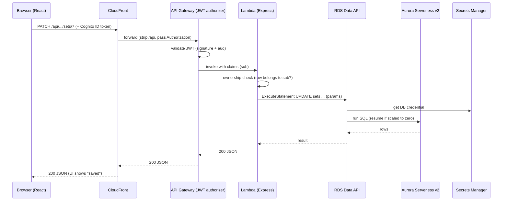

# Request Lifecycle — "what happens when I log a set"

A single end-to-end trace through every service. Use this for the "walk me through your
architecture" moment.

## The hops

1. **Browser (React SPA).** User types a weight and blurs the input. The app calls
   `PATCH /api/workouts/12/exercises/3/sets/7` with a JSON body, attaching the user's
   **Cognito ID token** in the `Authorization: Bearer …` header.
2. **CloudFront.** The request hits the nearest edge location. The `/api/*` cache behavior
   (caching disabled) forwards it to the **API Gateway** origin. A small CloudFront Function
   strips the `/api` prefix, and CloudFront forwards the `Authorization` header.
3. **API Gateway (HTTP API).** The **Cognito JWT authorizer** validates the token —
   signature against the user pool's keys, and the `aud` claim against the app client. If
   valid, the request proceeds with the decoded claims (including the user's `sub`).
4. **Lambda.** API Gateway invokes the function (warm = ~ms; cold = bundle load). The Express
   app (via `serverless-express`) routes to the set-update handler. It reads `sub` from the
   JWT claims and verifies the workout/exercise/set belong to that user (ownership check).
5. **RDS Data API → Aurora.** The handler calls the Data API with a parameterized
   `UPDATE sets …`. No VPC/connection pool — the Lambda calls an AWS endpoint with IAM, and
   the Data API uses the **Secrets Manager** credential to reach **Aurora Serverless v2**.
   (If Aurora was scaled to zero, the first call resumes it; the helper retries.)
6. **Back out.** Aurora → Data API → Lambda returns JSON → API Gateway → CloudFront → browser.
   React updates local state; the set shows "saved."
7. **Side channels.** The Lambda emits **CloudWatch Logs** and **X-Ray** traces throughout.

## Sequence diagram

## Where each Well-Architected concern shows up

- **Security:** TLS at every hop; JWT validated at the edge of the API; ownership re-checked
  in code; IAM-scoped Data API; secret never in code.
- **Cost:** no idle compute (Lambda per-invoke, Aurora scale-to-zero), no NAT/ALB.
- **Reliability:** managed, multi-AZ services; resume-retry for the cold path.
- **Performance:** CloudFront edge; warm Lambda ~ms; the only slow path is a cold resume.
- **Operational excellence:** CloudWatch + X-Ray give logs and a trace of exactly these hops.
