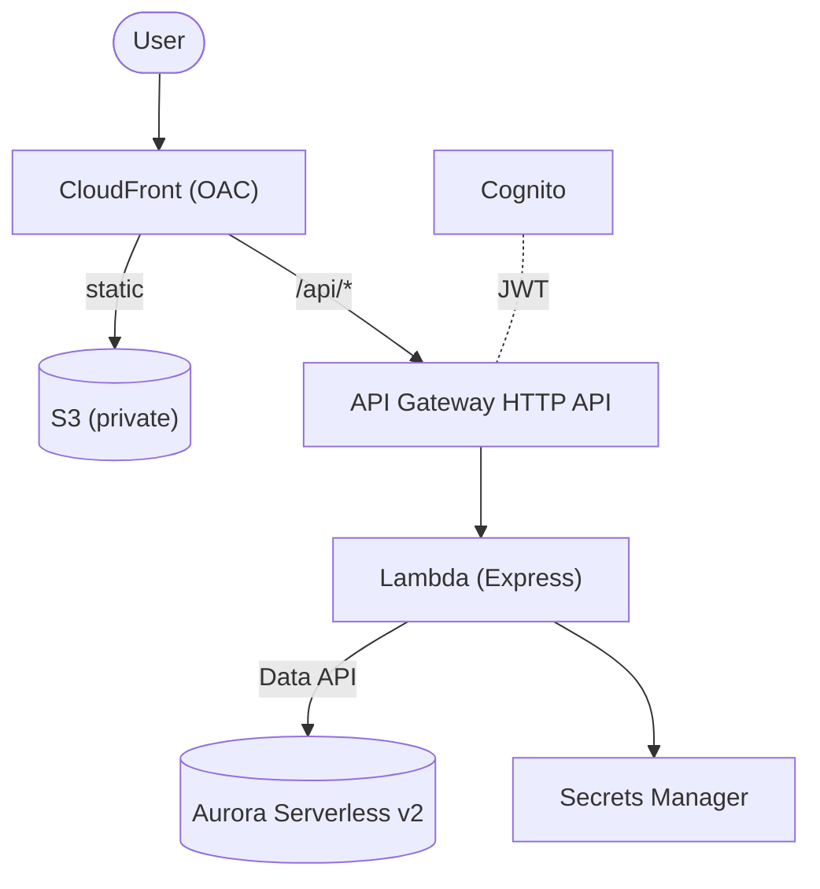

# Workout Tracker — Infrastructure (AWS CDK, TypeScript)

Infrastructure-as-Code for **Target A — Serverless (Refactor)**. See
[`../docs/ARCHITECTURE.md`](../docs/ARCHITECTURE.md) for the design and
[`../docs/adr/0001-…`](../docs/adr/0001-target-architecture-serverless-vs-containers.md)
for why this target was chosen. Target B (containers) is documented as a stub in
[`lib/target-b-containers.stub.ts`](./lib/target-b-containers.stub.ts).

## What gets deployed

| Construct | Resources |
|---|---|
| `network` | VPC, isolated subnets, **0 NAT gateways** |
| `data` | Aurora Serverless v2 (Postgres, **scale-to-zero**), KMS key, generated secret |
| `auth` | Cognito user pool + app client |
| `compute` | Lambda (Express via serverless-express), API Gateway HTTP API + Cognito authorizer |
| `frontend` | Private S3 bucket, CloudFront (OAC), `/api/*` proxied to the HTTP API |
| `observability` | X-Ray tracing, CloudWatch dashboard + error alarm |



## Prerequisites

- Node.js 20+, an AWS account, and credentials configured (`aws configure` / SSO)
- AWS CDK Toolkit: `npm i -g aws-cdk` (or use the local `npx cdk`)
- Docker is **not** required (NodejsFunction bundles with esbuild)

## Deploy

```bash
cd infra
npm install
npx cdk bootstrap          # one-time per account/region
npx cdk synth              # optional: inspect the CloudFormation
npx cdk deploy             # provisions everything; prints outputs

# (optional) build & ship the SPA, then redeploy so it uploads to S3:
cd ../client && npm run build && cd ../infra && npx cdk deploy
```

Outputs include `SiteUrl` (CloudFront), `ApiEndpoint`, `UserPoolId`, `UserPoolClientId`,
and `SiteBucketName`.

## Validate (tests + security linting)

```bash
cd infra
npm install
npm test            # CDK assertion tests (Jest) — encode the security & cost decisions
npm run nag         # cdk synth with cdk-nag (AWS Solutions ruleset)
```

- **`npm test`** synthesizes the stack and asserts the decisions that matter: **0 NAT
  gateways**, Aurora **scale-to-zero** + **encrypted** + Data API on, KMS rotation, S3
  public-access fully blocked, Lambda X-Ray tracing, the **Cognito JWT authorizer**, the
  CloudFront `/api/*` behavior, and the error alarm. Bundling is skipped in tests, so no
  esbuild/Docker is needed.
- **`npm run nag`** runs **cdk-nag**. Intentional demo gaps are captured as **documented
  suppressions** in `lib/workout-tracker-stack.ts` — each one names the production fix.

## 💸 Cost warning — READ THIS

This is a **demo** stack tuned for near-zero idle cost, but **a few things still bill while
deployed**:

- **Aurora Serverless v2** — scales to **0 ACU** when idle (compute ≈ $0), but you still
  pay **storage (~$0.10/GB-mo)** and there's a **~5–15s resume** on the first query after
  idle. (Set min capacity > 0 for production to remove the resume latency — and accept
  ~$43/mo+.)
- **KMS customer-managed key** — ~$1/mo. **Secrets Manager** — ~$0.40/secret/mo.
- **CloudFront / S3 / API GW / Lambda / Cognito** — effectively $0 at idle (pay-per-use,
  free tiers).

👉 **When you're done demoing, tear it all down:**

```bash
npx cdk destroy
```

Everything uses `RemovalPolicy.DESTROY` / `autoDeleteObjects`, so destroy leaves nothing
behind that bills. (For production you'd flip retention/`deletionProtection` on the data
tier — intentionally off here for clean teardown.)

## What's intentionally omitted (demo vs production)

| Omitted here | Add for production |
|---|---|
| Custom domain + ACM cert | Route 53 + ACM on CloudFront |
| AWS WAF WebACL | Attach managed rule groups (SQLi, rate limit, etc.) |
| Aurora min capacity > 0 / provisioned concurrency | Remove cold starts at a cost |
| Multi-AZ / Aurora Global | HA and/or multi-region |
| Cognito user-migration trigger | Migrate existing bcrypt users on first sign-in |
| cdk-nag / assertion tests | ✅ **included** — `npm test` + `npm run nag` (wire into CI) |

## Security posture (as built)

- Least-privilege IAM — the function may only call the Data API on **this** cluster and
  read **this** secret.
- KMS encryption at rest (Aurora); TLS in transit (CloudFront, API GW, Data API).
- No secrets in code/env — DB credentials live in Secrets Manager.
- Private S3 (OAC only); no public-facing compute.
